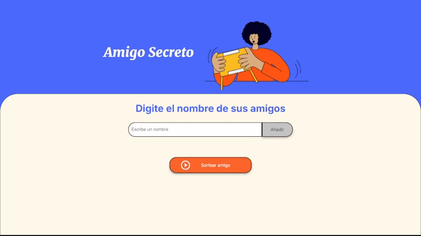

# Amigo Secreto

Este es un programa simple que permite agregar nombres a una lista y luego sortear un amigo al azar.



Pruebalo en el siguiente link: https://carlovich01.github.io/challenge-amigo-secreto_esp-main/

## Estructura del Proyecto

El proyecto tiene la siguiente estructura de archivos:

- `index.html`: Contiene la estructura HTML de la página.
- `style.css`: Contiene los estilos CSS para la página.
- `app.js`: Contiene la lógica JavaScript para agregar nombres y sortear amigos.
- `assets/`: Contiene las imágenes utilizadas en la página.

## Funcionalidades

### Agregar Amigos

Los usuarios escribirán el nombre de un amigo en un campo de texto y lo agregarán a una lista visible al hacer clic en "Adicionar". 

### Validar entrada

Si el campo de texto está vacío, el programa mostrará una alerta pidiendo un nombre válido.

### Visualizar la lista 

Los nombres ingresados aparecerán en una lista debajo del campo de entrada.

### Sorteo aleatorio

Al hacer clic en el botón "Sortear Amigo", se seleccionará aleatoriamente un nombre de la lista y se mostrará en la página.

## Instalación y ejecucion

1. Clona este repositorio en tu máquina local:
    ```sh
    git clone https://github.com/Carlovich01/challenge-amigo-secreto_esp-main.git
    ```
2. Navega al directorio del proyecto:
    ```sh
    cd challenge-amigo-secreto_esp-main
    ```
3. Abre el archivo index.html en tu navegador web.


